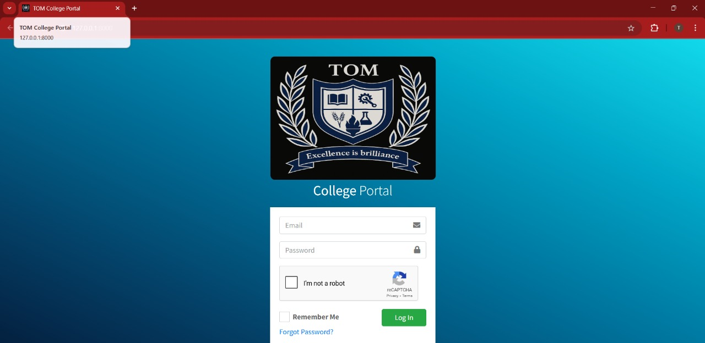
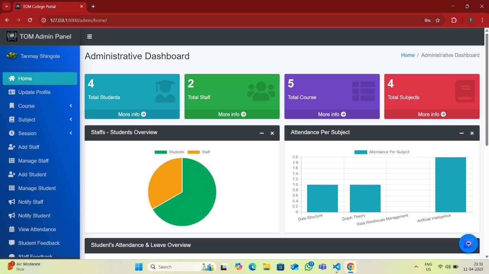
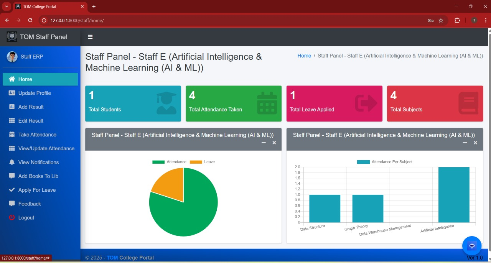
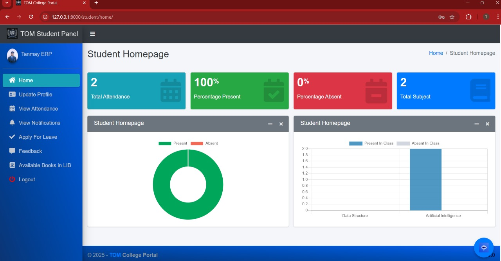

# 🚀 Project Name: TOM – Smart Academic Management System

### 📖 Description
A full-stack academic management system designed for schools and universities, offering real-time dashboards, AI-powered chatbot support, and automated workflows. Built to improve efficiency, data visibility, and academic operations.

---

### 🧠 Features
- 🔹 Real-time academic dashboards
- 🔹 AI chatbot for user interaction and support
- 🔹 Role-based access for admin, faculty, and students
- 🔹 Automated attendance, marks, and event tracking
- 🔹 Clean UI and mobile-friendly design

---

### 🛠️ Tech Stack
- **Frontend:** HTML, CSS, Bootstrap
- **Backend:** Python, Django
- **Database:** MySQL
- **Other:** AI Chatbot (Dialogflow or custom), Chart.js

---

### 📸 Screenshots

  
*User login interface*

  
*Real-time academic dashboard*

  
*AI-powered chatbot interface*

  
*Role-based staff access*

  
*Student information and attendance view*


---

### 🚀 How to Run the Project
```bash
# Clone the repository
git clone https://github.com/your-username/project-name.git

# Navigate to project directory
cd project-name

# Install dependencies
pip install -r requirements.txt

# Run the project
python manage.py runserver
